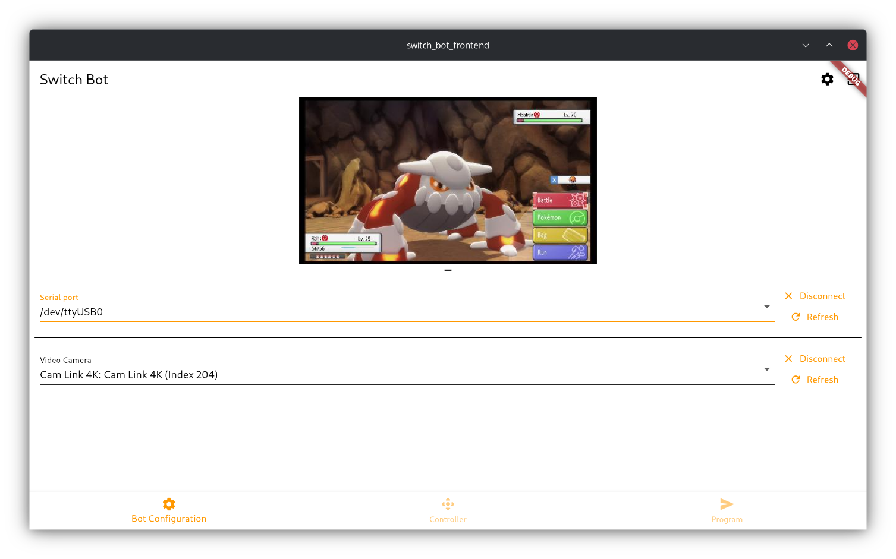
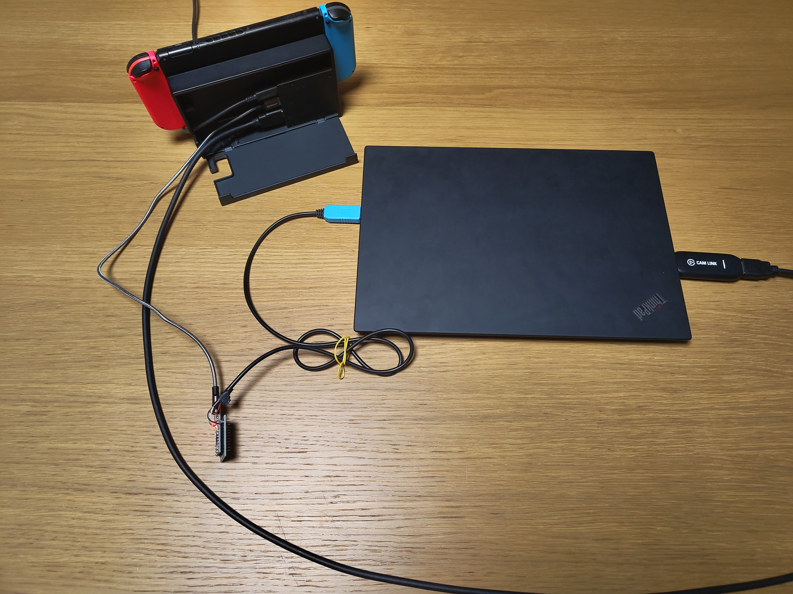

# SwitchBot 
**Disclaimer: this project is a very big Proof of Concept. I keep working on it sporadically but the repo is here to just get it out there. The install instructions are probably hard to follow and/or incomplete.**

SwitchBot is a small framework to write bots for playing games on the Nintendo Switch.

SwitchBot works on a physical Switch in dock mode, not an emulator. It provides a way to send inputs to the Switch through a virtual controller, while the display output from the Switch is captured using an HDMI-to-USB capture card.

## How it works
Input is provided to the Switch through a "virtual" controller - an Arduino that has one USB cable connected a computer and takes commands from there. The other end also has a USB cable connected to the USB port on the back side of the Switch dock. The Arduino pretends to be a USB controller using the [SwitchJoystick](https://github.com/HackerLoop/Arduino-JoyCon-Library-for-Nintendo-Switch) library.

Output is received from the switch using any compatible capture card that can capture the HDMI output of the dock.

## Screenshots and images
### UI
<figure>
    
    <figcaption>Screenshot of the device config screen.</figcaption>
</figure>
<figure>
    <video src="https://github.com/user-attachments/assets/8891c358-590e-4eb0-bf97-ead1a023b6b4" controls autoplay>
        Your browser does not support HTML5 videos.
    </video>
    <figcaption>Video of the virtual controller UI.</figcaption>
</figure>

### Hardware
<figure>
    
    <figcaption>The capture card and Pro Micro connected to a laptop and a Switch console.</figcaption>
</figure>

    <figure width="50%">
        
        <figcaption>Detail view of the Pro Micro's connections. Note: native USB side is connected to Switch, USB-to-UART side is connected to the laptop.</figcaption>
    </figure>

## Structure
This repository contains several sub-projects that make up the whole SwitchBot.

The project is split into three parts:
- Controller: The Arduino code to emulate the controller for the Switch.
- Backend: A Python webserver that houses the main logic for the Switch Bot. It sends commands to the controller and allows for running custom-made programs/scripts. The backend has no graphical output itself; you must use the frontend to use any of the actual functionality.
- Frontend: The UI to control and configure the backend. Can be run locally in the browser or on mobile devices as an app. Allows you to set up the hardware of the SwitchBot (such as choosing on which port the controller is connected and which camera the capture card outputs to) and to start any programs you want to run.

## Requirements
- For the controller:
    - Arduino IDE (v1 or v2 should both work fine)
    - At least one ATmega32u4-based Arduino (or Arduino-like) microcontroller
    - Some very basic electronics knowledge
    - Some jumper cables and a breadboard
    - 1 Micro-USB cable 
    - 1 USB-to-UART cable
- For the backend:
    - A computer running a Python version compatible with the used dependencies
- For the frontend:
    - An IDE with Flutter support 
    - The Flutter SDK
    - If you want to export the frontend to an Android device: Android Studio

## Setup
1. Controller:
    1. Build the hardware. Use the [instructions](controller/README.md) in the `controller` directory.
    2. Follow the install instructions at [https://github.com/squirelo/Arduino-JoyCon-Library-for-Nintendo-Switch](https://github.com/squirelo/Arduino-JoyCon-Library-for-Nintendo-Switch). If using Arduino IDE v2, you will need to add another line with `myboard.bootloader.tool.default=avrdude` to `boards.txt`.
    3. Open, build and upload the code to the microcontroller. **Important**: connect to the native USB port of the microcontroller to upload, *not* the UART-to-USB side.
2. Backend:
    1. Open a shell in the `backend` directory.
    2. (Optional, but recommended: use `python -m virtualenv .venv` and the OS-specific commands to enable the virtual environment.)
    3. Install the dependencies by running `pip install -r requirements.txt`
3. Frontend:
    1. Open the `frontend` directory in a Flutter-supported IDE of your choice (I use IntelliJ).
    2. Run the project on a device (currently supported are Windows, Linux and Android).

## Running
1. Start the backend by running `python main.py` in the `backend` directory. If using a `virtualenv`, activate the environment first.
2. Start the frontend and enter the IP and port of the computer you're running the backend on. 
3. Connect the controller to the computer running the backend. Make sure to connect the correct Arduino to the computer and the other one to the Switch. If switched, the SwitchBot will not work.
4. Choose the serial port of the controller on the `Bot Configuration` tab.
5. Choose the camera the capture card is outputting to. Make sure to wake the Switch in the dock so that it outputs to the dock. If you are using a laptop with (multiple) built-in webcams, you might have to do some trial-and-error to find the correct camera.
6. (Optional: use the `Controller` tab to check whether you can send button presses to the Switch. If not, make sure you are using the correct serial port and that everything is connected correctly.)
7. You are ready to go! Use the `Program` tab to choose a program to run or use the `Controller` tab to input things manually.

## Writing custom programs
You can write your own logic to be executed by the SwitchBot. 

Programs are written in Python, just like the rest of the backend. All subdirectories in `backend/programs` are scanned for valid programs when starting the backend. 

*TODO: write the rest of this section*
